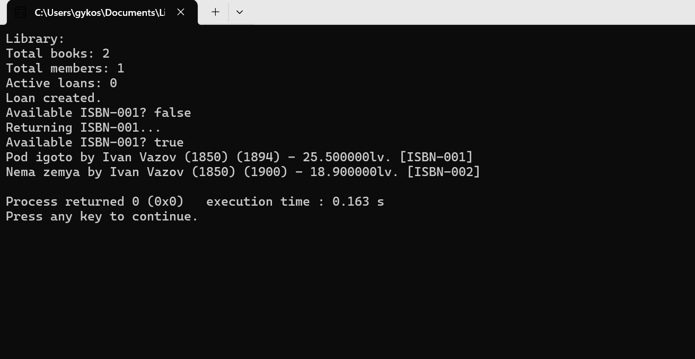

# Библиотечна система
## Описание
Проектът представлява малка библиотечна система, написана на C++.  
Програмата позволява да се добавят книги с техните автори, да се регистрират читатели (members), да се взимат книги на заем (loans) и да се връщат.

## Компилация и изпълнение
Отворете терминал в директорията на проекта и изпълнете:

```bash
g++ -std=c++17 -Wall -Wextra -O2 main.cpp -o library
```
След това стартирайте програмата:
```bash
./library
```

## Примерен изход:
```bash
Library:
Total books: 2
Total members: 1
Active loans: 0
Loan created.
Available ISBN-001? false
Returning ISBN-001...
Available ISBN-001? true
Pod igoto by Ivan Vazov (1850) (1894) - 25.500000 lv. [ISBN-001]
Nema zemya by Ivan Vazov (1850) (1900) - 18.900000 lv. [ISBN-002]
```


### Клас Author

Представя автор на книга със следните характеристики:

**Членове:**

* `string name` — име на автора
* `int birthYear` — година на раждане

**Методи:**

* `Author(string n, int y)` — параметризиран конструктор
* `getName() / getBirthYear()` — връщат съответно името и годината
* `setBirthYear(int y)` — задава година на раждане с валидация
* `to_string()` — връща текстово представяне на информацията за автора


### Клас Book

Представя книга с основни характеристики:
 
**Членове:**

* `string title` — заглавие
* `Author author` — автор
* `int year` — година на издаване
* `double price` — цена
* `string isbn` — идентификатор за дадена книга
* `static int totalBooks` — брояч на всички създадени книги

**Методи:**

* Конструктори и деструктори
* `getTitle() / getAuthor() / getYear() / getPrice() / getIsbn()
setYear(int) / setPrice(double)` — с валидация
* `to_string()` — връща текстово описание на книгата
* `getTotalBooks()` — връща броя на създадените книги


### Клас Member

Представя читател/член на библиотеката.

**Членове:**

* `string name` — име на читателя
* `string memberId` — уникален идентификатор
* `int yearJoined` — година на присъединяване

**Методи:**

* `Member()` — конструктор по подразбиране
* `Member(string n, string id, int year)` — параметризиран конструктор
* `getName() / getMemberId() / getYearJoined()` — връщат съответно името, ID и годината на присъединяване
* `setName(const string&) / setMemberId(const string&) / setYearJoined(int)` — задават стойности с валидация на `memberId`
* `to_string()` — връща текстово представяне на информацията за читателя


### Клас Loan

Представя заем на книга:

**Членове:**

* `string isbn` — ISBN на книгата
* `string memberId` — ID на читателя
* `string startDate` — дата на заема
* `string dueDate` — крайна дата
* `bool returned` — статус на връщане

**Методи:**

* Конструктор с валидация на дати
* `markReturned()` — отбелязва, че книгата е върната
* `isOverdue(string today)` — проверява дали заема е проточен
* `to_string()` — текстово представяне на информация за заема


### Клас Library

Управлява книги, читатели и заеми.

**Членове:**
* `vector<Book> books` — списък с налични книги
* `vector<Member> members` — списък с регистрирани читатели
* `vector<Loan> loans` — списък с активни заеми

**Методи:**
* `addBook(const Book&) / addMember(const Member&)` - добавя книга / добавя читател
* `hasBook(string isbn)` — проверява наличност
* `isBookAvailable(string isbn)` — проверява дали дадена книга е дадена на заем
* `loanBook(...)` — създава заем
* `returnBook(...)` — връща книга
* `findByAuthor(string)` — намира книги по автор
* `to_string()` — представя обобщена информация за библиотеката



## Автор
**Име:** Ира Костадинова  
**Номер:** 22212  
**Курс:** Обектно-ориентирано програмиране (C++)  
**Дата:** 02.12.2025


